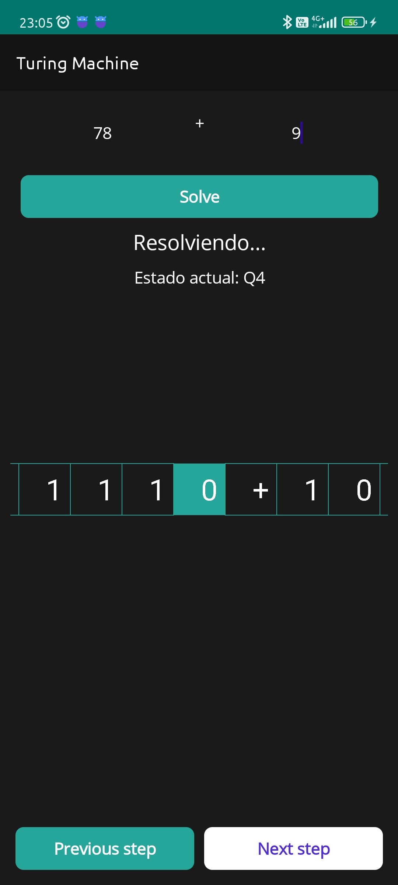
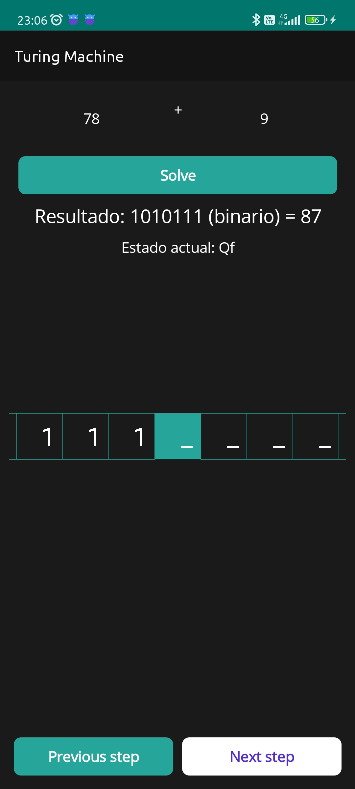

# Turing Machine
A Turing Machine to perform the binary addition of two numbers

This was a project that was going to be delivered for the subject of Formal
Languages and Automata, but in the end it was changed by an AFD for the
deliverable, so this project was just another experiment. It works better on
Android (maybe also on iOS), I developed it thinking on portability due
I don't have a laptop.

I'd still like to finish it, so here's a list of things I'd like to add:

## To do:
- Finish the graphical interface
- Fix MAUI Windows interface
- Add auto step (instead of clicking step by step)
- Full translate to english

## Possible changes:
- Change MAUI to Avalonia
- Improve tape drawing, maybe add animations
- Rewrite all the code

## Screenshots:

| Solving State                                                        | Result                                                               |
|----------------------------------------------------------------------|----------------------------------------------------------------------|
|  |  |